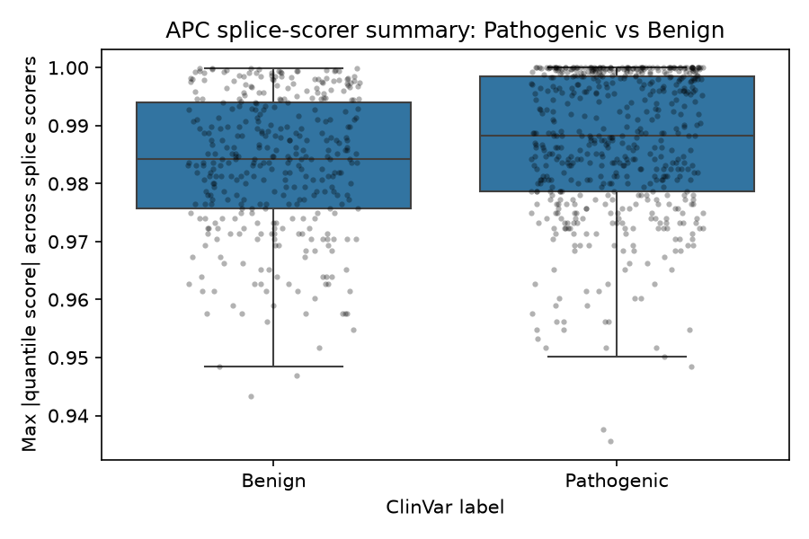
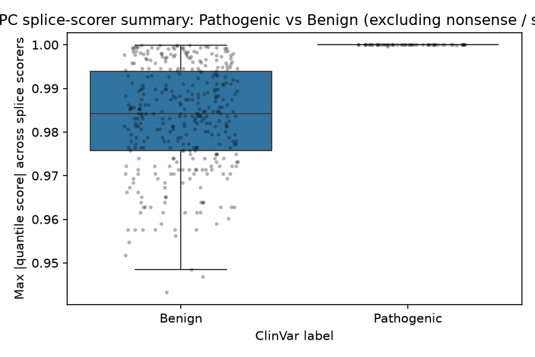
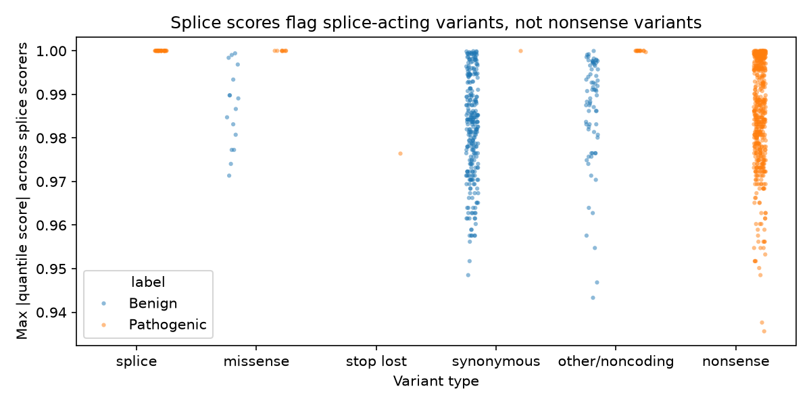

# AlphaGenome Scoring: APC Splice Variants

Scores ClinVar-annotated APC variants with AlphaGenome's splice-related
scorers (`SPLICE_SITES`, `SPLICE_SITE_USAGE`, `SPLICE_JUNCTIONS`) and checks
whether the scores separate Pathogenic from Benign variants. See
`main.ipynb` for the full pipeline.

## Method

- **Data**: cleaned ClinVar APC variants (`data/apc_variants.csv`), 548
  Pathogenic / 362 Benign.
- **Scoring**: each variant is scored in a 1MB window with AlphaGenome's
  three recommended splice scorers, producing one row per
  variant/gene/scorer/track in a tidy table (`data/tidy_splice_scores.parquet`).
- **Per-variant summary**: for each variant, the max absolute
  `quantile_score` across all APC rows (every scorer, every tissue/junction
  track). `quantile_score` (not `raw_score`) is used because it's calibrated
  to a common `[0, 1]` percentile scale, so it's safe to combine across
  scorers that otherwise have very different units and very different
  numbers of tracks per variant.
- **Comparison**: Pathogenic vs Benign on the summary score, run once on all
  variants and again excluding nonsense/stop-lost variants (whose mechanism
  of pathogenicity isn't splicing, so splice scorers can't be expected to
  catch them).

## Results

| | Count (P / B) | Median (P / B) | P above B median | P above every B |
|---|---|---|---|---|
| All variants | 548 / 359 | 0.988 / 0.984 | 59.1% | 11.3% |
| Excluding nonsense / stop-lost | 53 / 359 | 1.000 / 0.984 | 100.0% | 98.1% |

**What separated:** across all variants, splice scores barely separated
Pathogenic from Benign — 59% of Pathogenic variants scored above the Benign
median, where 50% would be chance. But 494 of 548 Pathogenic variants are
nonsense, which harm the protein by truncating it rather than by changing
splicing. Excluding nonsense and stop-lost variants, all 53 remaining
Pathogenic variants scored above the Benign median, and 52 scored above
every Benign variant.

**One limit:** the summary takes the maximum percentile across thousands of
tissue tracks, which pushes nearly every variant toward 1.0. That compresses
the visible gap between groups, and the excluded-variant comparison rests on
only 53 Pathogenic variants.

## Plots

**All variants:**

**Excluding nonsense / stop-lost variants:**

**By consequence type:**

